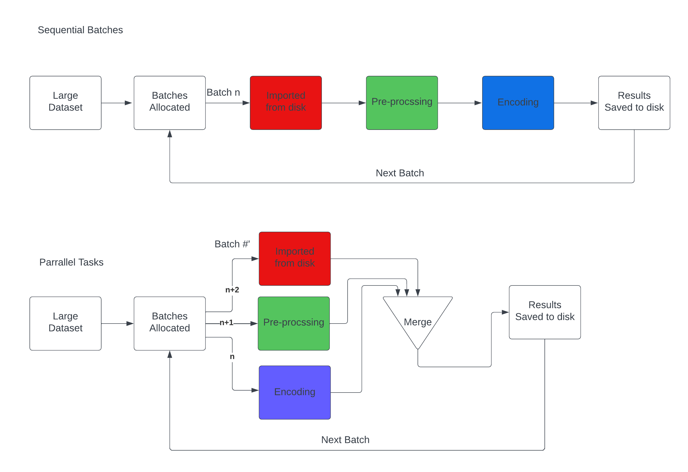

# Time-lapse Outlier Detection

This project aims to use Machine Vision, unsupervised learning, and clustering techniques to learn to identify outliers in large image datasets, such as those used for time-lapse video creation. The project is a work in progress and has been undertaken in stages to provide a comprehensive understanding of the development process.

## Stage 1: Proof of Concept

  
I began by creating a simple case: a single image of a child's toy on a white background, decomposed into 100 sub-images. Using k-means clustering in[image_clustering.ipynb](image_clustering.ipynb), I implemented a pre-trained CNN called "VGG16" to extract key features from each image and group them based on similarity.

The clusters where then translated into groups of files for visualisation - correctly showing that I had created a group of background images and a group with just the images of the toy.

  

I refined the process in [image_clustering_innate_parallel.ipynb](https://chat.openai.com/c/image_clustering_innate_parallel.ipynb) by importing all images at once and passing them to the encoder in a batch, speeding up the test case.

  

## Stage 2: HDBSCAN Implementation

For real data, I don't know the number of clusters beforehand, so I used an [HDBSCAN](https://hdbscan.readthedocs.io/en/latest/basic_hdbscan.html) implementation in [hdbscan_clustering.ipynb](hdbscan_clustering.ipynb) Using the same feature extraction technique, the HDBSCAN produced comparable results on the test dataset, grouping background images into a cluster and leaving images with the toy in the "noise" group, as shown below:

  

## Stage 3: Large-Scale Test Data

I implemented two approaches to handle large-scale test data:

1.  **Frequent saving:** In [batchwise_feature_extraction.py](batchwise_feature_extraction.py), I divided the input dataset into batches sized to fit into 8-10GB of VRAM and saved the resulting encoding as a pickle file after each batch.
    
2.  **Parallel Workers:** I designed a parallel worker implementation to minimize downtime for any resource, which is still under development. The logic for this implementation is shown below:

The parallel scheme here is intended to maximise resource utilisation ensuring that the disk connection (red), CPU (green) and GPU (blue) are all idle for as little time as possible - no matter which part of the process ends up being the bottleneck. 

## Stage 4: Clustering with API

With a set of around 750,000 realistic images now encoded, I implemented clustering based on Stage 2 in [hdb_clustering.py](hdb_clustering.py) and then [clustering_api.py](clustering_api.py), enabling it to run under uvicorn and RapidAPI. Users can tweak parameters, and further feature encodings can be added over time. An implementation for linux machines which are able to use [the Rapids.ai GPU based HDBSCAN](https://developer.nvidia.com/blog/faster-hdbscan-soft-clustering-with-rapids-cuml/) is [here](clustering_api_linux.py)
  

The CPU clustering implementation is set up so that the user submits jobs for background execution and can pull their results from a saved library once completed. Timing estimates are fed back for un-solved parameter sets. The linux implementation, being faster, has been amended to return either graphs of clustering outcomes or clustered sets of images for user inspection. 

With all of the above implemented I was able to select some parameters for the clustering scanner to segment the images into a reasonable number of groups. This segmentation was propogated out and a random sample of the images in each group is presented via the API. This grouping is, unfortunately, poor. This is primarily because the CNN used is trained on ImageNet rather than our own unlabelled data. The [alternatives are discussed here](models%26weights.md), along with recommendations for commercial and academic implementations of this code. The nature of this project though means that a pre-trained model has to be used despite its limitations.

## Stage 5: Interactivity and Visualization

In this stage the matplotlib static figures were replaced with mpld3 interactive javascript visualisaitons. The main changes were in the js used to understand and display the API responses - these are included as exemplars in the  [example websites](example_websites) folder. The drawback of this library is that all of the points are sent by the API as text encoded within the JSON response, while this can be compressed in transit it still results in large messages. The plotting then relies on client-side JSON processing to display all the points, which can be resource intensive and thus only small collections of points should be shown in this way.

Some visualisation tweaks were also made to the API and displaying webpages, in order to better gain an understanding of the grouping process. These visualisations would be helpful in benchmarking the encoding and segregation performance of any future models.

## Stage 6: Replacing clustering with FAISS

In this phase I will be looking at the point at which clustering can be replaced by a more straightforward "nearest existing image" search implemented in FAISS. This would mean that new images can be classified without having to recluster the existing database. The downside is that we need to estimate how far away from the existing groups is "too far" for the new image to be a part of that group. We may also miss the formation of new groups on a new part of the graph, simply because we're looking at new images one at a time.

Speed, convenience, and proximity metrics are investigated in [this notebook](FAISS.ipynb)

## Stage 7: Putting FAISS into an API

Given that FAISS appears to be a viable solution for the "next" images, and that it only runs effectively on powerful machines, an appropriate API has been built to accept images and predict which cluster of pre-existing images they belong to. This completes the project, and should create a workflow by which junk images in time-lapse data sets can be eliminated. 
  

> Written with [StackEdit](https://stackedit.io/).