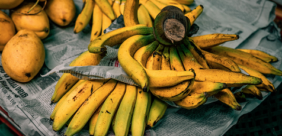

# Model Selection Considerations
To group images by similarity, we first need to compute an embedding for each image, effectively a vector representation. The quality of embeddings varies, as they aim to identify "important" parts of the image while disregarding "less important" aspects.

Each model is trained to recognize useful parts of an image for categorization. For example, ImageNet is a collection of images labeled with the presence or absence of 1,000 object categories such as foxes or bananas. It's conceivable that our images could be equally "banana-like" according to a model trained on ImageNet, though this is unlikely. In this document, I'll outline the available options in order of performance, from best to worst.

In this document I'll lay out the options we have in order of performance, best to worst.

## Option 1 - Custom Trained Models

The ideal scenario involves using a model fine-tuned on the dataset in question, ensuring the model better understands the input images. There are several ways to achieve this:

### Self-Supervised learning 

Self-supervised learning (SSL) differs from supervised learning by employing an algorithm that generates "pseudo-labels," iteratively refining them to produce a classifier for our dataset. The META AI Team has implemented one such method in [DINO](https://arxiv.org/abs/2104.14294?fbclid=IwAR2Uyp3EJfPMiNpScWAqFkiVJ0GRbt21U4zhi-I9KFlxa4TLbzAVybCkBwg) & [DINOv2](https://github.com/facebookresearch/dinov2). Their tests on ImageNet sets, however, indicate that training a CNN for classification can take [days or weeks of compute time](https://github.com/facebookresearch/dino?fbclid=IwAR1iKye0pDOmOYckMwByOZzb1uiMJwvsPwpCyIm9OqTauBE3rZk5bFpRECA#multi-node-training), even on multi-noded multi-GPU systems.

Implementing this method would involve training the model on a representative sample of inputs (e.g., all images from April 2022), which would likely take 5-6 months on a single GPU workstation. 

Such an investment would not be suitable for a self-motivated hobby project.

### Supervised learning

Under this paradigm, labeled examples of images are used to train a CNN from scratch or to fine-tune a pre-trained model. This requires hand-labeled examples of relevant classes in the dataset. While the labels themselves aren't used, images need proper segmentation, which is part of the task we aim to achieve.

## Option 2: Pre-trained models

These models have been trained to recognize diverse image features. ImageNet, for example, includes a wide variety of subjects and scenes with complex hidden features such as hidden foxes and bunches of bananas: 

 

Although our real images aren't particularly similar to the training set, some are bound to resemble foxes more than others. Fine-tuning the pre-trained model would improve performance, but this requires segmentation and labeling of a portion of the real image set, one of the project's goals.

# Summary:

If cost were not a concern, or the benefits of finding outliers far exceeded training expenses, DINO would be the best option for training an image classifier. This might be the case for tasks like identifying bank robbers in CCTV footage or detecting inappropriate images in a commercial database.

However, our test data consists of time-lapse footage from a domestic garden, where there is no monetary value in perfectly identifying all outlier images. Thus, using a pre-trained model will suffice. The code has been implemented in a way that allows for the easy integration of other models after training, so if a more valuable dataset emerges, only minor changes would be needed.

The initial embeddings and clustering have been performed using a [pre-trained VGG16 model](https://keras.io/api/applications/vgg/#vgg16-function). While it would be interesting to compare this to other models, the accuracy of the clustering itself is a secondary goal for this project. The primary aim is to learn the techniques and methodology behind outlier detection.