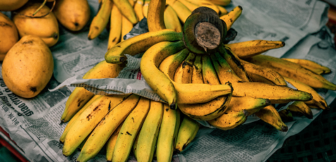

# Model Selection Considerations
In order to group images by similarity we first need to compute an embedding for each image, which is effectively a vector representation of the image. Not all embeddings are as good as one another though. The embedding itself is effectively looking for "important" parts of the image and paying more attention to that than what it's previously determined to be "less important".

Each model is trained to understand what parts of an image are useful in knowing how to categorise that image. ImageNet for example is a collection images hand labeled with the presence or absence of 1000 object categories such as foxes or bananas. It's conceivable that all of our images are equally "bannana-like" according to a model trained on ImageNet. However, this is unlikely.

In this document I'll lay out the options we have in order of performance, best to worst.

## Option 1 - Custom Trained Models

This is the ideal scenario. Instead of using a generalist model, it's better to use a model that has been fine-tuned on the dataset being used. That way, the underlying model better understands the input images. This can be done via a number of methods:

### Self-Supervised learning 

Self-supervised learning (SSL) is slightly different from supervised learning. We design an algorithm that can generate a “pseudo-label”,then we iteratively refine those pseudo-labels, until we acheive a model that can be used as a classifier for our dataset. One such method has been implemented in [DINO](https://arxiv.org/abs/2104.14294?fbclid=IwAR2Uyp3EJfPMiNpScWAqFkiVJ0GRbt21U4zhi-I9KFlxa4TLbzAVybCkBwg) & [DINOv2](https://github.com/facebookresearch/dinov2) by the META AI Team, however their tests against ImageNet sets have shown that even on multi-noded multi-GPU systems training a CNN for clasification can take [days or weeks of compute time](https://github.com/facebookresearch/dino?fbclid=IwAR1iKye0pDOmOYckMwByOZzb1uiMJwvsPwpCyIm9OqTauBE3rZk5bFpRECA#multi-node-training).

If this was implemented, the model could be trained on a representative sample of inputs (all the images from April 2022 for example would include night/day, sun/rain, windy/calm) and then the resulting CNN could be used a good feature extraction tool for the remainder of the clustering workflow. This would represent training on  40,000 images, and on a single GPU workstation would probably only take 5-6 months.

This level of investment is not appropriate for a self-motivated hobby project.

### Supervised learning

Under this paradigm labelled examples of the images are used to either train a CNN from scratch or to fine-tune a pre-trained model. This is a straightforward process, but requires hand-labelled examples of relevant classes of image present in the dataset. The labels themselves will not be used, but the images would need to be well segmented, and this is part of the task we're trying to acheive.

## Option 2: Pre-trained models

These models have been trained to recognise diverse image features. ImageNet includes a wide variety of subjects and scenes with complex hidden features such as hidden foxes and bunches of bananas: 

 

While our real images are not particularly similar to the training set, some are bound to look more like foxes than others. We can improve the pre-trained model by fine-tuning, but this again requires segmentation and labelling of part of the real image set, which was one of the goals of this project.

# Summary:

If money was not a concern, or the benefits of finding these outliers far exceeded the cost of the training, then DINO would be our best option by far for training an image classifier. I could see this being the case if we were looking for bank robbers in CCTV footage, or looking for innappropriate images in a commercial database. 

However the test data we have is time-lapse footage from a domestic garden - there's no monetary value in prefectly finding all outlier images. This means that using a pre-trained model will suffice. The code has been implemented in such a way that any other model could be dropped in after training though, so if a more valuable dataset emerges only minor changes should be needed. 

The initial embeddings and clustering has been performed on a [pre-trained VGG16 model](https://keras.io/api/applications/vgg/#vgg16-function). While it would be interesting to compare this to other models, the accuracy of the clustering itself is a secondary goal for this project whose aim is to learn the techniques and methodology behind outlier detection. 